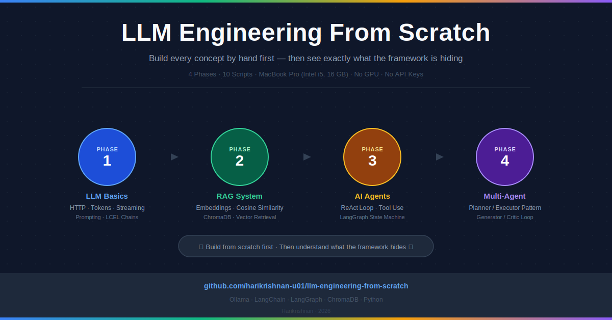
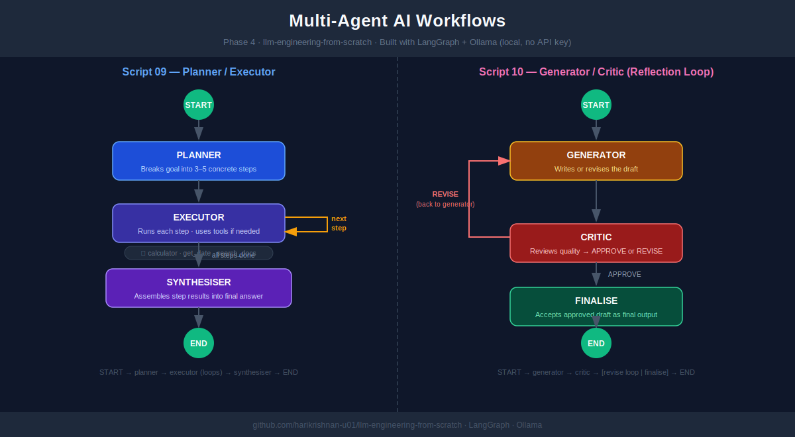

# llm-engineering-from-scratch

[](LICENSE)
[](https://www.python.org/)
[-orange.svg)](https://ollama.com)



A hands-on curriculum for learning modern LLM engineering — from raw API calls through production-grade multi-agent workflows — entirely on your local machine with no API keys required.

## What This Project Teaches

This project is structured as a four-phase learning path that builds understanding progressively. Each concept is first implemented from scratch (no frameworks), then rebuilt using the framework equivalent so you see exactly what the abstraction is hiding. By the end you will understand:

- How LLMs work at the HTTP level — tokens, streaming, response structure
- Prompt engineering techniques — system prompts, few-shot examples, chain-of-thought, temperature
- LangChain Expression Language (LCEL) — chaining components with the `|` operator
- How embeddings represent meaning as vectors and enable semantic search
- How RAG (Retrieval-Augmented Generation) works: chunking, embedding, retrieval, context injection
- Conversational RAG — follow-up questions using message history instead of a memory object
- How agents work: the ReAct (Reasoning + Acting) loop — Thought → Action → Observation → repeat
- Tool use — defining and calling tools (calculator, date lookup, document search) from within an agent
- How to build multi-agent systems with LangGraph: planner/executor, generator/critic, reflection loops

---

## Learning Path

| Phase | Topic | Scripts | Key Concepts |
|-------|-------|---------|--------------|
| 1 | LLM Basics | 01–03 | Raw HTTP calls, token streaming, prompt engineering, LCEL chaining |
| 2 | RAG System | 04–06 | Embeddings, cosine similarity, vector search, ChromaDB, conversational RAG |
| 3 | Single Agent | 07–08 | ReAct (Reasoning + Acting) loop, tool use, LangGraph state machines |
| 4 | Multi-Agent | 09–10 | Planner/executor pattern, Generator/Critic pattern, self-reflection loops |

Run scripts in order: **01 → 02 → 03 → 04 → 05 → 06 → 07 → 08 → 09 → 10**

> Script 06 must run before 07–10 because it builds the ChromaDB vector index that later scripts query.

---

## Prerequisites

### 1. Install Ollama (Local LLM Server)

Ollama runs LLMs locally on your machine. All scripts in this project connect to it on `http://localhost:11434`.

1. Download from [https://ollama.com/download](https://ollama.com/download) and drag the app to Applications.
2. Launch Ollama, then open Terminal and pull the required models:

```bash
# Language model for text generation
ollama pull llama3.2

# Embedding model for RAG and semantic search
ollama pull nomic-embed-text
```

> **Tip:** If your machine is slow, try smaller models like `phi3` or `gemma2` instead of `llama3.2`. Just update the model name in the scripts or in your `.env` file.

Ollama runs a persistent local server on port 11434. You can verify it is running with:

```bash
curl http://localhost:11434/api/tags
```

### 2. Python Environment

Requires Python 3.10+.

```bash
# Create and activate a virtual environment
python3 -m venv venv
source venv/bin/activate  # On Windows: venv\Scripts\activate

# Install dependencies
pip install -r requirements.txt
```

### 3. Environment Variables (Optional)

Create a `.env` file in the project root to override defaults:

```
OLLAMA_BASE_URL=http://localhost:11434
```

---

## Project Structure

```
ai-learning-app/
├── data/
│   ├── sample_docs/            # Knowledge base documents for RAG experiments
│   │   ├── intro_to_llms.txt   # Covers tokens, context windows, temperature, embeddings
│   │   └── rag_overview.txt    # Covers RAG architecture and common failure modes
│   └── chroma_db/              # Persistent vector store (created when you run script 06)
├── scripts/
│   ├── phase1_llm_basics/
│   │   ├── 01_raw_llm_call.py  # Direct HTTP calls to Ollama; streaming vs. blocking
│   │   ├── 02_prompting.py     # System prompts, few-shot, chain-of-thought, temperature
│   │   └── 03_langchain_llm.py # LangChain wrappers, LCEL | chaining, batch processing
│   ├── phase2_rag/
│   │   ├── 04_embeddings.py    # Embed text, compute cosine similarity with numpy
│   │   ├── 05_rag_scratch.py   # Full RAG pipeline in pure Python, no frameworks
│   │   └── 06_rag_langchain.py # Same pipeline with LangChain + ChromaDB + conversational RAG
│   ├── phase3_agents/
│   │   ├── 07_react_scratch.py   # ReAct loop (Thought→Action→Observation) built by hand
│   │   └── 08_langgraph_agent.py # Same agent rebuilt as a LangGraph state machine
│   └── phase4_multiagent/
│       ├── 09_planner_executor.py  # Planner/Executor: one agent plans, another runs each step
│       └── 10_reflection_loop.py   # Generator/Critic: draft → critique → revise loop
├── src/
│   ├── ollama_client.py        # Thin wrapper around Ollama REST API (reused by all phases)
│   └── tools.py                # Shared tool functions used by agents: calculator, get_date, search_docs
├── LEARNING_PLAN.md            # Detailed learning objectives for each phase
├── QUICK_REFERENCE.md          # Quick execution cheat sheet
└── requirements.txt
```

---

## Running the Scripts

Activate your virtual environment first, then run any script directly:

```bash
source venv/bin/activate

# Phase 1 — LLM Basics
python scripts/phase1_llm_basics/01_raw_llm_call.py
python scripts/phase1_llm_basics/02_prompting.py
python scripts/phase1_llm_basics/03_langchain_llm.py

# Phase 2 — RAG
python scripts/phase2_rag/04_embeddings.py
python scripts/phase2_rag/05_rag_scratch.py
python scripts/phase2_rag/06_rag_langchain.py   # builds ChromaDB index

# Phase 3 — Agents
python scripts/phase3_agents/07_react_scratch.py
python scripts/phase3_agents/08_langgraph_agent.py

# Phase 4 — Multi-Agent
python scripts/phase4_multiagent/09_planner_executor.py
python scripts/phase4_multiagent/10_reflection_loop.py
```

---

## Key Libraries

| Library | Purpose |
|---------|---------|
| `requests` | Raw HTTP calls to the Ollama REST API |
| `langchain-ollama` | `ChatOllama` and `OllamaEmbeddings` wrappers |
| `langchain-core` | LCEL primitives — `ChatPromptTemplate`, `RunnablePassthrough`, `StrOutputParser`, message types |
| `langchain-community` | `DirectoryLoader`, `TextLoader`, `Chroma` vector store integration |
| `langchain-text-splitters` | `RecursiveCharacterTextSplitter` for intelligent document chunking |
| `langgraph` | `StateGraph`, `ToolNode`, conditional edges — turns agent loops into explicit state machines |
| `chromadb` | Persistent vector database — stores and queries embeddings on disk |
| `numpy` | Cosine similarity calculations for the from-scratch RAG pipeline |
| `python-dotenv` | Load configuration from `.env` |

---

## Design Philosophy

- **No magic.** Every concept is first implemented by hand, then shown with a framework so you understand what the abstraction provides.
- **Local first.** Ollama runs everything on your machine — no OpenAI API key, no cloud costs, works offline.
- **Minimal dependencies.** Plain Python scripts with no Jupyter notebooks or extra orchestration layers.
- **Correct order matters.** Each phase builds on the previous one, and the ChromaDB index built in Phase 2 is used by Phases 3 and 4.

---

## Agent Workflow Diagram



---

## Key Patterns Explained

**ReAct (Reasoning + Acting)**
A loop where the agent alternates between thinking (*Thought*), choosing a tool (*Action*), and processing the result (*Observation*) until it has enough information to answer. Script 07 builds this loop with a plain `while` loop and regex parsing; script 08 replaces it with a LangGraph state machine.

**Generator/Critic (Reflection Loop)**
Two agents collaborate: a *Generator* produces a draft answer, and a *Critic* evaluates it and either approves it or sends it back for revision with specific feedback. This loop repeats until the critic is satisfied or a maximum revision count is reached. Script 10 implements this pattern.

**Planner/Executor**
A *Planner* agent breaks a complex goal into a list of concrete steps. An *Executor* agent then runs each step in sequence, using tools as needed. Separating planning from execution allows each agent to specialise and makes multi-step tasks reliable. Script 09 implements this pattern.
